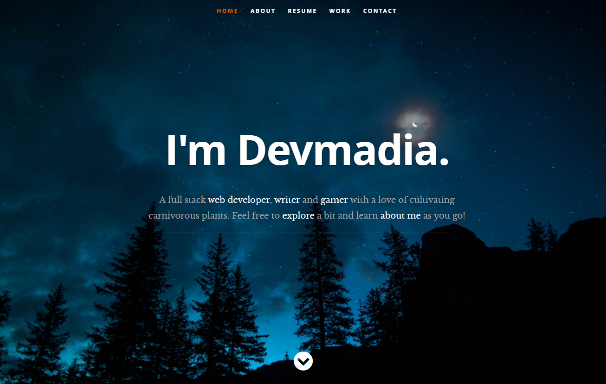
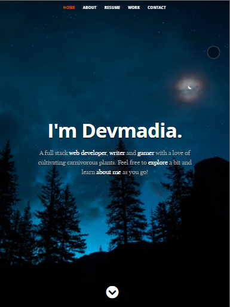

# Devmadia Portfolio

# Description
A fully functional React portfolio with all of Devmadia's developer projects for showcasing purposes.

## Table of Contents
  * [Installation](#installation)
  * [Usage](#usage)
  * [License](#license)
  * [Contributing](#contributing)
  * [Questions](#questions)

## Installation
Download a copy of this repo to a directory of your choice. To install, you will need to run `npm i` or `npm install` to get all the dependencies running. Following proper installation of the dependencies, you will type `npm start` on the root directory terminal to start the server.

To stop the server you will need to use the existing terminal to execute `CTRL+C` followed by `Y` for confirmation to terminate the connection to localhost.

Please see documentation on your own host's server commands should you run this on a live instance rather than locally.

## Usage
Be sure all repository files were successfully cloned to server and a connection to the database is complete.

Deployment: https://devmadia.github.io/

 

Once the website is deployed, it will look like the above image.

 

A demonstration of the viewport feature as appears above.

Header bar is fully navigatable and takes visitors to the appropriate locations. Resume is available for download.

## License
 This project is covered by the MIT license.

## Contributing
At this time, I am not seeking contributors to my portfolio.

## Questions
Please contact Devmadia by clicking below for immediate questions regarding site content:

For other projects by Devmadia [click here](https://github.com/Devmadia)